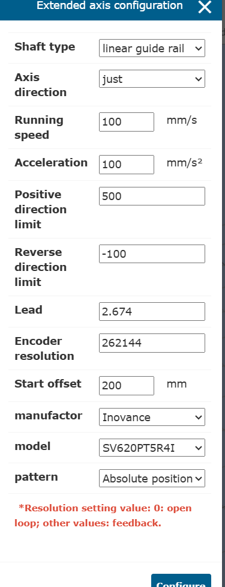

# SouthernHen
This Repo contains the southern hen code and the point table needed for all programs

# Set Up instructions:

## Step 1: Set up hardware
- For this, please refer to instructions in https://github.com/Devonics-Inc/FrPalletizingSetup
- When setting up the rail, you may get communication errors on the encoder that read E731.0
- If you see this, do the following:
    1) Flip up the screen at the top of the encoder and press "Mode" (or "Set" first, I can't remember as im writing this). It will then allow you to modify the register value that you'd like to edit.
    2) Use the up/down arrows to adjust the values of the register until you see get "h0d.20" and press "set"
    3) Here, you should see a blinking "0". You'll need to set that to "1"  (using the up arrow) press set and then power cycle.

## Step 2: Mounting the robot and setting up the code
- After mounting the robot so that the heavy lead from the robot is coming out in the same direction of the external wire tread.
- Set up your DI/DO wires for the signal and the slave/master communication
- Import the point table and the programs provided in this Repo

## Step 3: Mount the vacuum gripper
- Mount the gripper to the end of the robot, run the wire down the length of the arm and to the control box. 
- Connect the 24V and 0V to the EXTERNAL power supply mounted in the top right of the control tower.
- Connect the grounds of the control box to the ground of the PLC pin board (bottom row, column 5 of the control box to the 6th column from the left and the 3rd row from the top of the board mounted to the right of the PLC).
- Connect input wires 1 and 2 of the grippern to the control box's DO 2 and 3 respectively

## Step 4: Setting up rail params
 - The provided code should have the propper UDP set up, but you'll need to give it the values the first time you set it up. Screen shots of the correct parameters can be found in this repo.
 - In "Initial"->"Peripheral"->"Ext. Axis" select Ext. Axis + UDP.
 - Change exaxis number to 1
 - Edit the "Communication config" to have the following values:

    - IP address: 192.168.57.88
    - Port number: 2021
    - Communication cycle: 2ms
    - Packet loss detection time: 50ms
    - Packet loss times: 10
    - Communication interval: 50 ms
    - Automatic reconnection after interuption: enabled
    - Reconnection period: 2ms
    - Number of reconnections: 5
    - Position completion time: 1000ms

 - Click configure, load, and then save (the checkmark at the top)
 - Navigate to "Initial"->"Base"->"Coordinate"->"Ext. Axis"
 - Select extaxis1
 - Click edit, select "param config" and enter the following values: 
 [size=.20]
 - Click save and then the check mark at the top
 - Now you're good to go!
